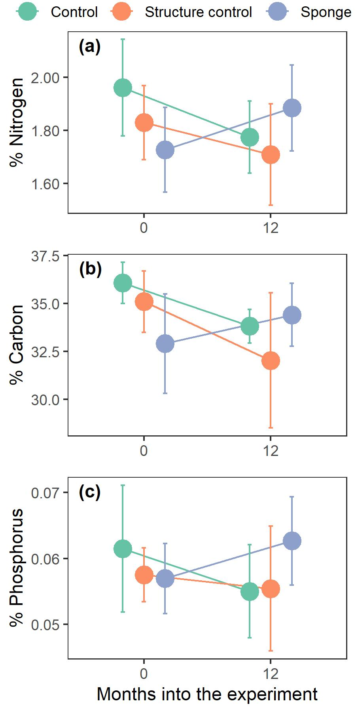

Stephanie K. Archer^1^*, Philina English^2^, Finella Campanino^1^, Craig A. Layman   
  
1. Louisiana Universities Marine Consortium, Chauvin, Louisiana USA
2. Pacific Biological Station, Fisheries and Oceans Canada, Nanaimo, British Columbia Canada  
  
*corresponding author: sarcher@lumcon.edu

```{r setup, include=FALSE}
knitr::opts_chunk$set(echo = TRUE)
source("scripts/03_reimport.R")#imports all the data sets
if(!require(cowplot))install.packages("cowplot");library(cowplot)
```

# Abstract  
  
# Introduction  
	
  
# Methods  
## Study site and experimental design  
This study was conducted in a shallow (1.1 m low tide depth) seagrass bed located off of Southern Great Abaco Island, The Bahamas (26.02610 N, 77.37408 W). Fifteen 5 x 5 m plots were delineated in a continuous seagrass bed on June 9, 2013 by placing wooden stakes at the corners and center of each plot. All plots were separated >2 m. Prior to the establishment of the treatments, all response variables were measured (see below). After preliminary data were collected, each plot was randomly assigned to one of three treatments: control (n=5), structure control (n=5), or sponge (n=5; Fig. S1). A polypropylene model of a sponge was placed inside a cage at the center of each structure control plot. A single sponge (*Ircinia felix*, average volume ± standard deviation, 2.5 ± 0.75 L) was placed inside a cage in the center of each sponge plot.  Control plots were not manipulated. All response variables were measured 1, 5, 12, and 17 months after the treatments were established. Live sponges were replaced as needed with a total of 3 individual sponge replacements, all occurring within the first month of the experiment. 

## Seagrass Response Variables  
Three species of seagrass were observed in the experimental plots: *Thalassia testudinum*, *Syringodium filliforme*, and *Halodule wrightii*. *S. filliforme* and *H. wrightii* were initially rare and patchily distributed with a combined density of 149.2 ± 172 shoots m^-2^ (mean ± sd).  Therefore our initial focus was on the response of *T. testudinum* and species specific responses were not measured for either *S. filliforme* or *H. wrightii*. *T. testudinum* growth, short shoot density, and nutrient content were measured.  
Shoot densities were determined in three 1x1 m quadrats within each plot. One quadrat was placed around the sponge or sponge model (sponge and s. control plots) or the center (control plots), this quadrat is referred to as the 0-0.5m quadrat. The next 1 m^2^ quadrat was placed immediately adjacent to the 0-0.5 m quadrat extending from 0.5-1.5 m away from the center point of the plot. A final quadrat was placed 1.5-2.5 m away from the center point (Fig. S1). Within each 1 m^2^ quadrat four 20 cm x 20 cm quadrats were haphazardly placed and the shoots of each seagrass were counted (*S. filliforme* and *H. wrightii* were recorded together). *T. testudinum* growth was measured using the standard blade hole punching technique [@zieman1974] at the center of the plot or immediately next to either the sponge, or polypropylene model of the sponge (i.e., 0 m), 0.5 m, 1.0 m, and 2.0 m away. In order to minimize disturbance to the plots, the growth and morphometrics (blade length and width) of five short shoots per distance were measured *in situ*. The second youngest blade was collected from 10 shoots in the center of each plot for nutrient analysis prior to the beginning of the experiment and again after 1 year. Seagrass nutrient content (%C, %N, and %P) was determined by drying the blades at 60ºC for 48-72 hours. The dried tissue was then ground. For %C and %N analysis seagrass tissue was then weighed into tin capsules, and sent to the University of Georgia Stable Isotope Ecology Laboratory for analysis.Percent phosphorus (%P) was determined by dry oxidation acid hydrolysis extraction followed by colorimetric analysis [@fourqurean1992].  

## Macroalgae Response Variables  
The response of the macroalgae communities was monitored throughout the course of the experiment. All macroalgae were identified to genus and recorded.If identification was not possible in situ, a representative sample was photographed and subsequently collected.For algae where individuals were difficult to distinguish (e.g. *Laurencia* spp.) clumps of algae were recorded as individuals.Macroalgae densities were averaged over three 1 m^2^ quadrats to get a per m^2^ estimate of abundance for each plot. The macroalgae community was quantified within the same 1 m^2^ quadrats as seagrass shoot density. 
  
## Analysis  
## Shoot densities
## *Thalassia testudinum* growth  
## *Thalassia testudinum* nutrient concentrations 
## Macroalgae abundance and community structure

# Results  
```{r results function,include=FALSE}
aov.res<-function(rtable,row){
  tv<-round(rtable[row,4],2)
  pv<-ifelse(rtable[row,5]< 0.001, "p < 0.001", paste("p =", round(rtable[row,5],2)))
  return(paste("=",tv,",",pv))
}
aov.df<-function(rtable,row){
  return(round(rtable[row,3],0))
}

```

## Shoot densities
## *Thalassia testudinum* growth  
## *Thalassia testudinum* nutrient concentrations  
```{r nutrients, include=FALSE}
source("scripts/06_nutrient_explore.R")
```


Initially, seagrass in sponge plots had significantly lower nitrogen concentrations than control plots (Fig. \@ref(fig:nuts)A, t~`r aov.df(nbs$coefficients,3)`~ `r aov.res(nbs$coefficients,3)`) but not structure control plots (t~`r aov.df(nfs$coefficients,3)`~ `r aov.res(nfs$coefficients,3)`). Percent nitrogen in seagrass tissues in both control and structure control plots declined similarly over time (Fig. \@ref(fig:nuts)A, t~`r aov.df(nbs$coefficients,5)`~ `r aov.res(nbs$coefficients,5)`), but the decrease was only significant in control plots (control: t~`r aov.df(nbs$coefficients,4)`~ `r aov.res(nbs$coefficients,4)`, structure control: t~`r aov.df(nfs$coefficients,4)`~ `r aov.res(nfs$coefficients,4)`). Conversely, seagrass in sponge plots responded differently than both the control (t~`r aov.df(nrs$coefficients,5)`~ `r aov.res(nrs$coefficients,5)`) and structure control (t~`r aov.df(nrs$coefficients,6)`~ `r aov.res(nrs$coefficients,6)`) plots: it had a higher % nitrogen after one year (Fig. \@ref(fig:nuts)A). However, this increase was not significant (t~`r aov.df(nrs$coefficients,4)`~ `r aov.res(nrs$coefficients,4)`).  
The pattern was similar for percent carbon, seagrass in sponge plots was initially lower than control (Fig. \@ref(fig:nuts)B, t~`r aov.df(cbs$coefficients,3)`~ `r aov.res(cbs$coefficients,3)`) and structure control plots (t~`r aov.df(cfs$coefficients,3)`~ `r aov.res(cfs$coefficients,3)`). Again, percent carbon in seagrass tissue decreased in a similar way in both control and structure control plots (Fig. \@ref(fig:nuts)B, t~`r aov.df(cbs$coefficients,5)`~ `r aov.res(cbs$coefficients,5)`). However, this decrease was only significant in structure control plots (control: t~``r aov.df(cbs$coefficients,4)`~ `r aov.res(cbs$coefficients,4)`, structure control: t~`r aov.df(cfs$coefficients,4)`~ `r aov.res(cfs$coefficients,4)`). In sponge plots, % carbon showed a slight increased in seagrass tissues (t~`r aov.df(crls$coefficients,4)`~ `r aov.res(crls$coefficients,4)`), resulting in a significantly different response than structure control plots (t~`r aov.df(crls$coefficients,6)`~ `r aov.res(crls$coefficients,6)`) but not control plots (t~`r aov.df(crls$coefficients,5)`~ `r aov.res(crls$coefficients,5)`).  
Phosphorus concentrations were similar in all plot types at the beginning of the experiment (Fig. \@ref(fig:nuts)C, control:structure control t~`r aov.df(pbs$coefficients,2)`~ `r aov.res(pbs$coefficients,2)`; control:sponge t~`r aov.df(pbs$coefficients,3)`~ `r aov.res(pbs$coefficients,3)`; structure control:sponge t~`r aov.df(pfs$coefficients,3)`~ `r aov.res(pfs$coefficients,3)`). Although % phosphorus in seagrass tissues followed the same patterns as both % nitrogen and % carbon, decreasing in control (Fig. \@ref(fig:nuts)C, t~`r aov.df(pbs$coefficients,4)`~ `r aov.res(pbs$coefficients,4)`) and structure control plots (t~`r aov.df(pfs$coefficients,4)`~ `r aov.res(pfs$coefficients,4)`) while increasing in sponge plots (Fig. \@ref(fig:nuts)C, t~`r aov.df(prs$coefficients,4)`~ `r aov.res(prs$coefficients,4)`), none of these changes are significant. However, the pattern of change over time was significantly different between control and sponge plots (t~`r aov.df(pbs$coefficients,6)`~ `r aov.res(pbs$coefficients,6)`), but not between structure control and sponge plots (t~`r aov.df(prs$coefficients,6)`~ `r aov.res(prs$coefficients,6)`) or control and structure control plots (t~`r aov.df(pbs$coefficients,5)`~ `r aov.res(pbs$coefficients,5)`).

  
## Macroalgae abundance and community structure
  
# Discussion  
  
  
# References  
<div id="refs"></div>  

# Figures

```{r nuts, echo=FALSE,message=FALSE, fig.cap="Seagrass nutrient concentrations prior to the initiation of the experiment and at one year into the experiment. (A) Percent nitrogen, (B) percent carbon, and (C) percent carbon in Thalassia testudinum tissue."}
pn<-ggplot(sgn %>%
    group_by(treatment, sampling, nut, dist) %>%
    summarize(mn = mean(nvalue), sdn = sd(nvalue)) %>%
    filter(sampling %in% c(1, 4) &
             dist == 0 & 
             nut %in% c("PN"))) +
   geom_line(aes(group=treatment,
                 x=as.factor(sampling),
                 y=mn,
                 color=treatment),
             position = position_dodge(width = .5))+
  geom_point(aes( x = as.factor(sampling),
      y = mn,
      color = treatment),
    size = 5,
    position = position_dodge(width = .5)) +
  geom_errorbar(aes(x = as.factor(sampling),
      ymin = mn - sdn,
      ymax = mn + sdn,
      color = treatment),
    width = .1,
    position = position_dodge(width = .5))+
  ylab("% Nitrogen")+
  scale_color_brewer(type="qual",
                      palette="Set2",
                      name="",
                      labels=c("Control","Structure control","Sponge"))+
  scale_x_discrete(labels = c(0,12))+
  theme(panel.grid = element_blank(),
         legend.position = "none",
        axis.title.x = element_blank())+
  scale_y_continuous(breaks=c(1.60,1.80,2.00),labels=c("1.60","1.80","2.00"))

pp<-ggplot(sgn %>%
    group_by(treatment, sampling, nut, dist) %>%
    summarize(mn = mean(nvalue), sdn = sd(nvalue)) %>%
    filter(sampling %in% c(1, 4) &
             dist == 0 & 
             nut %in% c("PP"))) +
  geom_line(aes(group=treatment,
                 x=as.factor(sampling),
                 y=mn,
                 color=treatment),
             position = position_dodge(width = .5))+
  geom_point(aes( x = as.factor(sampling),
      y = mn,
      color = treatment),
    size = 5,
    position = position_dodge(width = .5)) +
  geom_errorbar(aes(x = as.factor(sampling),
      ymin = mn - sdn,
      ymax = mn + sdn,
      color = treatment),
    width = .1,
    position = position_dodge(width = .5))+
  ylab("% Phosphorus")+
  xlab("Months into the experiment")+
  scale_color_brewer(type="qual",palette="Set2")+
  scale_x_discrete(labels = c(0,12))+
  theme(panel.grid = element_blank(),
         legend.position = "none")+
  scale_y_continuous(breaks=c(0.05,0.06,0.07))

pc<-ggplot(sgn %>%
    group_by(treatment, sampling, nut, dist) %>%
    summarize(mn = mean(nvalue), sdn = sd(nvalue)) %>%
    filter(sampling %in% c(1, 4) &
             dist == 0 & 
             nut %in% c("PC"))) +
  geom_line(aes(group=treatment,
                 x=as.factor(sampling),
                 y=mn,
                 color=treatment),
             position = position_dodge(width = .5))+
  geom_point(aes( x = as.factor(sampling),
      y = mn,
      color = treatment),
    size = 5,
    position = position_dodge(width = .5)) +
  geom_errorbar(aes(x = as.factor(sampling),
      ymin = mn - sdn,
      ymax = mn + sdn,
      color = treatment),
    width = .1,
    position = position_dodge(width = .5))+
  ylab("% Carbon")+
  scale_color_brewer(type="qual",palette="Set2")+
  scale_x_discrete(labels = c(0,12))+
  theme(panel.grid = element_blank(),
         legend.position = "none",
        axis.title.x = element_blank())
lgnd<-get_legend(pn + 
    guides(color = guide_legend(nrow = 1)) +
    theme(legend.position = "bottom"))
#without carbon
n1<-plot_grid(lgnd,pn,pp,labels = c("","A","B"),nrow=3,ncol = 1,rel_heights = c(.1,1,1))
#with carbon
n2<-plot_grid(lgnd,pn,pc,pp,labels = c("","A","B","C"),nrow=4,ncol = 1,rel_heights = c(.1,1,1,1.1))
ggsave(filename = "figures/nuts.pdf",plot=n2,width=3,height = 6)
ggsave(filename = "figures/nuts.jpg",plot=n2,width=3,height = 6)

```

